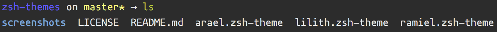
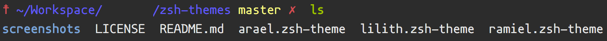
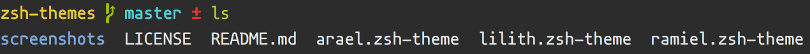

# zsh-themes

## arael

Simple zsh theme, slight modification of [gallifrey](https://github.com/robbyrussell/oh-my-zsh/blob/master/themes/gallifrey.zsh-theme).

## lilith

Another simple zsh theme, slight modification of [gallifrey](https://github.com/robbyrussell/oh-my-zsh/blob/master/themes/gallifrey.zsh-theme) and [hyperzsh](https://github.com/tylerreckart/hyperzsh).

## ramiel

Simple zsh theme, slight modification of [node](https://github.com/skuridin/oh-my-zsh-node-theme)

